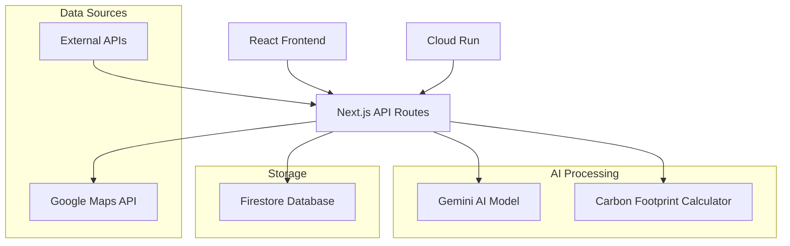

# EcoTrack Design Document

## Overview

EcoTrack is a Next.js-based web application that combines AI-powered sustainability analysis with real-time route planning to help users make environmentally conscious travel decisions. The system integrates Google Maps API for route data, Gemini AI for sustainability insights, and Firestore for data persistence, all deployed on Google Cloud Run for scalability.

## Architecture

### High-Level Architecture



### Technology Stack

- **Frontend**: React with Next.js 14+ (App Router)
- **Backend**: Next.js API Routes
- **AI/ML**: Google Gemini API for sustainability analysis
- **Maps & Routing**: Google Maps API (Routes, Places, Geocoding)
- **Database**: Firestore for user data and travel history
- **Deployment**: Google Cloud Run
- **Authentication**: Next-Auth.js with Google OAuth
- **Styling**: Tailwind CSS for responsive design

## Components and Interfaces

### Frontend Components

#### Core Components
- **TripPlanner**: Main interface for inputting origin/destination
- **RouteComparison**: Display multiple route options with sustainability metrics
- **SustainabilityDashboard**: User's environmental impact tracking
- **RouteMap**: Interactive map showing route options and transport modes
- **TravelHistory**: Historical trips and cumulative impact

#### UI Components
- **SustainabilityScore**: Visual indicator (0-100 scale) with color coding
- **CarbonFootprintCard**: Detailed emissions breakdown by transport mode
- **RouteOption**: Individual route display with time, cost, and environmental data
- **FilterControls**: Sort and filter routes by various criteria

### API Interfaces

#### Internal API Routes

```typescript
// /api/routes/plan
type RoutePlanRequest = {
  origin: string;
  destination: string;
  travelDate?: string;
  preferences?: {
    prioritizeSustainability: boolean;
    maxTravelTime?: number;
    budgetLimit?: number;
  };
}

type RoutePlanResponse = {
  routes: RouteOption[];
  sustainabilityInsights: string;
  conventionalComparison: ComparisonData;
}

// /api/sustainability/analyze
type SustainabilityAnalysisRequest = {
  routes: GoogleMapsRoute[];
  travelDate: string;
}

type SustainabilityAnalysisResponse = {
  analysis: RouteAnalysis[];
  aiInsights: string;
  recommendations: string[];
}

// /api/user/history
type TravelHistoryRequest = {
  userId: string;
  dateRange?: { start: Date; end: Date };
}

type TravelHistoryResponse = {
  trips: CompletedTrip[];
  cumulativeImpact: EnvironmentalMetrics;
  trends: TrendData[];
}
```

#### External API Integration

- **Google Maps Routes API**: Real-time route calculation with multiple transport modes
- **Google Places API**: Location autocomplete and details
- **Gemini API**: Sustainability analysis and recommendation generation
- **Public Transport APIs**: Real-time schedules and emissions data where available

## Data Models

### Core Data Models

```typescript
type RouteOption = {
  id: string;
  origin: Location;
  destination: Location;
  transportModes: TransportSegment[];
  duration: number; // minutes
  distance: number; // kilometers
  cost: number;
  carbonFootprint: number; // kg CO2e
  sustainabilityScore: number; // 0-100
}

type TransportSegment = {
  mode: 'car' | 'train' | 'bus' | 'plane' | 'bike' | 'walk' | 'metro';
  duration: number;
  distance: number;
  carbonEmission: number;
  cost: number;
  provider?: string;
}

type User = {
  id: string;
  email: string;
  preferences: Record<string, any>;
  createdAt: Date;
}

type CompletedTrip = {
  id: string;
  userId: string;
  route: RouteOption;
  completedAt: Date;
  carbonFootprint: number;
  carbonSaved: number;
}
```

### Database Schema (Firestore)

```
/users/{userId}
  - profile data
  - preferences
  - sustainability goals

/users/{userId}/trips/{tripId}
  - trip details
  - route information
  - environmental metrics

/users/{userId}/analytics/{period}
  - aggregated sustainability data
  - trends and insights
  - goal progress

/cache/routes/{routeHash}
  - cached route calculations
  - TTL: 1 hour for dynamic data
```

## Error Handling

### Error Categories and Responses

1. **API Rate Limiting**
   - Implement exponential backoff for external API calls
   - Cache frequently requested routes to reduce API usage
   - Graceful degradation with cached or approximate data

2. **External Service Failures**
   - Fallback to cached route data when available
   - Display user-friendly error messages with retry options
   - Log errors for monitoring and debugging

3. **Data Validation Errors**
   - Client-side validation for user inputs
   - Server-side validation with detailed error responses
   - Input sanitization to prevent injection attacks

4. **Authentication/Authorization**
   - Secure API routes with proper authentication checks
   - Handle expired sessions gracefully
   - Protect user data with proper access controls

### Error Response Format

```typescript
type ErrorResponse = {
  error: {
    code: string;
    message: string;
    details?: any;
  };
  fallbackData?: any;
}
```

## Testing Strategy

### Testing Approach

1. **Unit Testing**
   - Carbon footprint calculation functions
   - Data transformation utilities
   - API response parsing logic
   - React component rendering and interactions

2. **Integration Testing**
   - API route handlers with mock external services
   - Database operations with Firestore emulator
   - Authentication flow testing
   - End-to-end user journey testing

3. **Performance Testing**
   - API response times under load
   - Frontend rendering performance
   - Database query optimization
   - External API rate limiting handling

4. **Sustainability Data Accuracy**
   - Validate carbon footprint calculations against known benchmarks
   - Test AI-generated insights for relevance and accuracy
   - Compare route suggestions with manual sustainability analysis

### Testing Tools

- **Jest**: Unit and integration testing
- **React Testing Library**: Component testing
- **Playwright**: End-to-end testing
- **Firestore Emulator**: Database testing
- **MSW (Mock Service Worker)**: API mocking

## Security Considerations

1. **Data Protection**
   - Encrypt sensitive user data in Firestore
   - Implement proper CORS policies
   - Secure API keys and environment variables

2. **Authentication Security**
   - Use secure session management
   - Implement CSRF protection
   - Rate limiting on authentication endpoints

3. **API Security**
   - Input validation and sanitization
   - SQL injection prevention (though using NoSQL)
   - Proper error handling without information leakage

## Performance Optimization

1. **Caching Strategy**
   - Route calculations cached for 1 hour
   - Static sustainability data cached longer
   - CDN for static assets

2. **Database Optimization**
   - Efficient Firestore queries with proper indexing
   - Pagination for large datasets
   - Batch operations where possible

3. **Frontend Optimization**
   - Code splitting and lazy loading
   - Image optimization
   - Service worker for offline functionality

## Deployment Architecture

### Cloud Run Configuration

- **Auto-scaling**: 0-100 instances based on traffic
- **Memory**: 2GB per instance
- **CPU**: 2 vCPU per instance
- **Environment Variables**: Secure configuration management
- **Health Checks**: Custom health check endpoints

### CI/CD Pipeline

1. **Development**: Local development with emulators
2. **Staging**: Automated deployment on PR creation
3. **Production**: Manual approval required for deployment
4. **Monitoring**: Cloud Monitoring and Logging integration